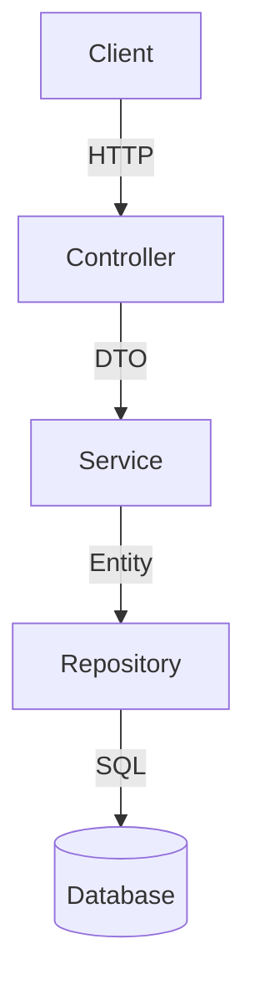

# 서비스 구조도

> 아키텍처 변경 시 자동 업데이트됨

## 레이어 구조



## 패키지 구조

```
com.taraethreads.tarae.
├── {domain}/
│   ├── controller/
│   ├── service/
│   ├── repository/
│   ├── domain/          (Entity, Value Object)
│   └── dto/             (~Request, ~Response)
└── global/
    ├── exception/       (CustomException, GlobalExceptionHandler)
    ├── config/          (Security, JPA, Swagger 등)
    └── common/          (BaseEntity 등)
```

## 도메인

| 도메인 | 설명 | 주요 Entity |
|--------|------|------------|
| place | 뜨개 관련 장소 | Place, Category, Tag, Brand |
| event | 뜨개 관련 이벤트/팝업/세일 | Event, EventType |
| request | 사용자 등록 요청 (관리자 승인 대기) | PlaceRequest, EventRequest |
| admin | 관리자 페이지 (Thymeleaf SSR) | — (place/event/request 도메인 활용) |
