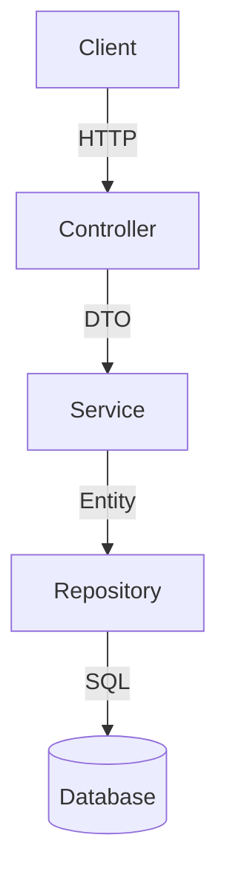

# 서비스 구조도

> 아키텍처 변경 시 자동 업데이트됨

## 레이어 구조



## 패키지 구조

```
com.taraethreads.tarae.
├── {domain}/
│   ├── controller/
│   ├── service/
│   ├── repository/
│   ├── domain/          (Entity, Value Object)
│   └── dto/             (~Request, ~Response)
└── global/
    ├── exception/       (CustomException, GlobalExceptionHandler)
    ├── config/          (Security, JPA, Swagger 등)
    └── common/          (BaseEntity 등)
```

## 도메인

(도메인 추가 시 업데이트)
