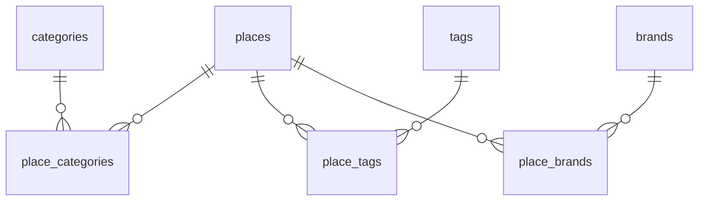

---

> **SDD (Software Design Document) 란?**
> "어떻게 만드는지" 를 정의하는 문서.
> 패키지 구조, 클래스 설계, API 명세, 테스트 전략 등 실제 구현 전 설계를 확정.

---

# SDD: B-02 Place 도메인
- 작성일: 2026-04-05
- 완료일: -
- 상태: Draft

## 기술 스택

- Kotlin + Spring Boot 3.5
- Spring Data JPA + Hibernate
- MySQL 8 (로컬: H2 테스트)
- JUnit 5 + MockK

## 아키텍처

```
com.taraethreads.tarae.
└── place/
    ├── controller/
    │   └── PlaceController.kt
    ├── service/
    │   └── PlaceService.kt
    ├── repository/
    │   └── PlaceRepository.kt
    ├── domain/
    │   ├── Place.kt
    │   ├── PlaceStatus.kt         (ENUM)
    │   ├── Category.kt
    │   ├── PlaceCategory.kt       (매핑 엔티티)
    │   ├── Tag.kt
    │   ├── PlaceTag.kt            (매핑 엔티티)
    │   ├── Brand.kt
    │   ├── BrandType.kt           (ENUM)
    │   └── PlaceBrand.kt          (매핑 엔티티)
    └── dto/
        ├── PlaceListResponse.kt
        └── PlaceDetailResponse.kt
```

## 도메인 모델

### Place

```kotlin
@Entity
class Place(
    val name: String,
    val region: String,
    val district: String,
    val address: String,
    val lat: BigDecimal?,
    val lng: BigDecimal?,
    val hoursText: String?,
    val closedDays: String?,
    val description: String?,
    val instagramUrl: String?,
    val websiteUrl: String?,
    val naverMapUrl: String?,
    val status: PlaceStatus = PlaceStatus.OPEN,

    @OneToMany(mappedBy = "place", fetch = FetchType.LAZY)
    val placeCategories: MutableList<PlaceCategory> = mutableListOf(),

    @OneToMany(mappedBy = "place", fetch = FetchType.LAZY)
    val placeTags: MutableList<PlaceTag> = mutableListOf(),

    @OneToMany(mappedBy = "place", fetch = FetchType.LAZY)
    val placeBrands: MutableList<PlaceBrand> = mutableListOf(),

    @Id @GeneratedValue(strategy = GenerationType.IDENTITY)
    val id: Long = 0,
) : BaseEntity()
```

### 매핑 엔티티 (PlaceCategory, PlaceTag, PlaceBrand)

복합 PK 대신 각 매핑 엔티티도 단독 PK 사용 (JPA 편의성).

## DB 설계



DDL: `src/main/resources/db/schema.sql`

### 주요 인덱스

| 테이블 | 컬럼 | 이유 |
|--------|------|------|
| places | region | 지역 필터 |
| place_categories | place_id, category_id | 카테고리 필터 |
| place_tags | place_id, tag_id | 태그 필터 |

## API 설계

### 목록 조회

```
GET /api/places
```

**Query Params**

| 파라미터 | 타입 | 필수 | 설명 |
|----------|------|------|------|
| region | String | N | 지역 필터 (서울, 경기 등) |
| categoryId | Long | N | 카테고리 필터 |
| tagId | Long | N | 태그 필터 |

**Response** `200 OK`

```json
[
  {
    "id": 1,
    "name": "실과 바늘",
    "region": "서울",
    "district": "성수",
    "address": "서울 성동구 ...",
    "status": "OPEN",
    "categories": [{ "id": 1, "name": "뜨개샵" }],
    "tags": [{ "id": 1, "name": "주차가능" }],
    "instagramUrl": "https://instagram.com/...",
    "naverMapUrl": "https://..."
  }
]
```

### 상세 조회

```
GET /api/places/{id}
```

**Response** `200 OK`

```json
{
  "id": 1,
  "name": "실과 바늘",
  "region": "서울",
  "district": "성수",
  "address": "서울 성동구 ...",
  "lat": 37.1234567,
  "lng": 127.1234567,
  "hoursText": "화~금 10:00-19:00, 토~일 09:00-19:00",
  "closedDays": "월요일",
  "description": "...",
  "status": "OPEN",
  "categories": [{ "id": 1, "name": "뜨개샵" }],
  "tags": [{ "id": 1, "name": "주차가능" }],
  "brands": [{ "id": 1, "name": "산네스간", "type": "YARN" }],
  "instagramUrl": "https://instagram.com/...",
  "websiteUrl": null,
  "naverMapUrl": "https://..."
}
```

**Error**

| 상황 | ErrorCode | HTTP Status |
|------|-----------|-------------|
| 존재하지 않는 id | PLACE_NOT_FOUND (404) | 404 |

## 테스트 전략

- **PlaceRepository**: `@DataJpaTest` — 필터 쿼리 검증 (지역, 카테고리, 태그)
- **PlaceService**: MockK 단위테스트 — 조회 위임, 없는 id 예외 처리
- **PlaceController**: `@WebMvcTest` — 응답 필드, 상태코드, 필터 파라미터 전달 검증
