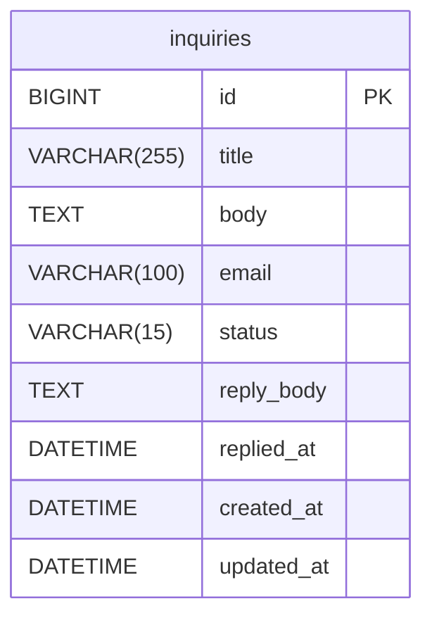

# SDD: 문의하기(inquiry) 기능

## 기술 스택
- Spring Boot + Kotlin
- Spring Data JPA / MySQL
- spring-boot-starter-mail (Gmail SMTP)
- Thymeleaf (관리자 페이지)
- 수동 SQL 마이그레이션 (db/migration/)

## 아키텍처

```
inquiry/
├── controller/
│   └── InquiryController.kt          # POST /api/inquiries
├── service/
│   └── InquiryService.kt
├── repository/
│   └── InquiryRepository.kt
├── domain/
│   ├── Inquiry.kt
│   └── InquiryStatus.kt
└── dto/
    ├── InquiryCreateRequest.kt
    └── InquiryCreateResponse.kt

admin/
├── controller/
│   └── AdminInquiryController.kt     # /admin/inquiries
├── service/
│   └── AdminInquiryService.kt
└── dto/
    ├── AdminInquiryListRow.kt
    ├── AdminInquiryDetailDto.kt
    └── AdminInquiryReplyRequest.kt

global/
└── mail/
    └── MailService.kt
```

## 도메인 모델

### InquiryStatus
```
PENDING      - 미확인 (초기 상태)
ANSWERED     - 답변 완료 (이메일 발송 성공)
SEND_FAILED  - 발송 실패 (답변 내용은 저장됨, 재발송 가능)
CLOSED       - 닫힘 (무시, 이메일 미발송)
```

### Inquiry Entity

| 필드 | 타입 | 설명 |
|------|------|------|
| id | Long | PK |
| title | String | 문의 제목 (255자) |
| body | String | 문의 본문 (TEXT) |
| email | String | 답변받을 이메일 (100자) |
| status | InquiryStatus | PENDING / ANSWERED / SEND_FAILED / CLOSED |
| replyBody | String? | 답변 내용 (TEXT, nullable) |
| repliedAt | LocalDateTime? | 답변 작성 일시 (이메일 발송 성공 시점) |
| createdAt | LocalDateTime | BaseEntity |
| updatedAt | LocalDateTime | BaseEntity |

### 상태 전이
```
PENDING     → answer()  → SEND_FAILED (저장만)
SEND_FAILED → markSent() → ANSWERED (발송 성공)
PENDING     → close()   → CLOSED
```
- `answer(replyBody)`: 답변 저장 + 상태 SEND_FAILED (서비스에서 이메일 발송 후 markSent 호출)
- `markSent()`: 상태 ANSWERED + repliedAt 기록
- 이미 ANSWERED / CLOSED 상태에서 answer() 호출 시 예외

## DB 설계



인덱스:
- `idx_inquiries_status` on `status` (목록 필터링용)

## API 설계

### 공개 API
| Method | URL | Request | Response | 설명 |
|--------|-----|---------|----------|------|
| POST | /api/inquiries | InquiryCreateRequest | InquiryCreateResponse (id) | 문의 제출 |

**InquiryCreateRequest**
```json
{ "title": "문의 제목", "body": "문의 내용", "email": "user@example.com" }
```

### 관리자 페이지 (Thymeleaf SSR)
| Method | URL | 설명 |
|--------|-----|------|
| GET | /admin/inquiries | 목록 (status 쿼리 파라미터 필터) |
| GET | /admin/inquiries/{id} | 상세 |
| POST | /admin/inquiries/{id}/reply | 답변 제출 (PENDING → ANSWERED or SEND_FAILED) |
| POST | /admin/inquiries/{id}/resend | 재발송 (SEND_FAILED → ANSWERED or SEND_FAILED) |
| POST | /admin/inquiries/{id}/close | 닫기 (PENDING → CLOSED) |

## 이메일 발송 흐름

```
AdminInquiryService.reply(id, replyBody):
  1. DB: inquiry.answer(replyBody) 저장 → 상태 SEND_FAILED (트랜잭션)
  2. MailService.send() 호출 (트랜잭션 밖)
     성공 → inquiry.markSent() 저장 → 상태 ANSWERED
     실패 → 상태 SEND_FAILED 유지, 에러 로그

AdminInquiryService.resend(id):
  1. 상태 SEND_FAILED 검증
  2. MailService.send() 호출
     성공 → inquiry.markSent() 저장 → 상태 ANSWERED
     실패 → 상태 SEND_FAILED 유지, 에러 로그
```

`MailService`는 `@Transactional` 없이 순수 발송 책임만 가짐.

## 예외 처리
| 상황 | ErrorCode | HTTP Status |
|------|-----------|------------|
| 존재하지 않는 문의 | INQUIRY_NOT_FOUND | 404 |
| ANSWERED/CLOSED 상태에서 답변 시도 | INQUIRY_ALREADY_PROCESSED | 409 |
| SEND_FAILED가 아닌 상태에서 재발송 시도 | INQUIRY_ALREADY_PROCESSED | 409 |
| 이메일 발송 실패 | 예외 throw 안 함 — 상태 SEND_FAILED 유지, 로그 기록 |

## 테스트 전략
- 단위 테스트 (MockK):
  - `Inquiry` 도메인 메서드 (answer, markSent, close) 상태 전이
  - `InquiryService` — 저장 검증
  - `AdminInquiryService` — 이메일 발송 성공/실패 시나리오별 상태 분기
- 통합 테스트 (@SpringBootTest + H2):
  - `POST /api/inquiries` 제출
  - 관리자 reply/resend/close 흐름
